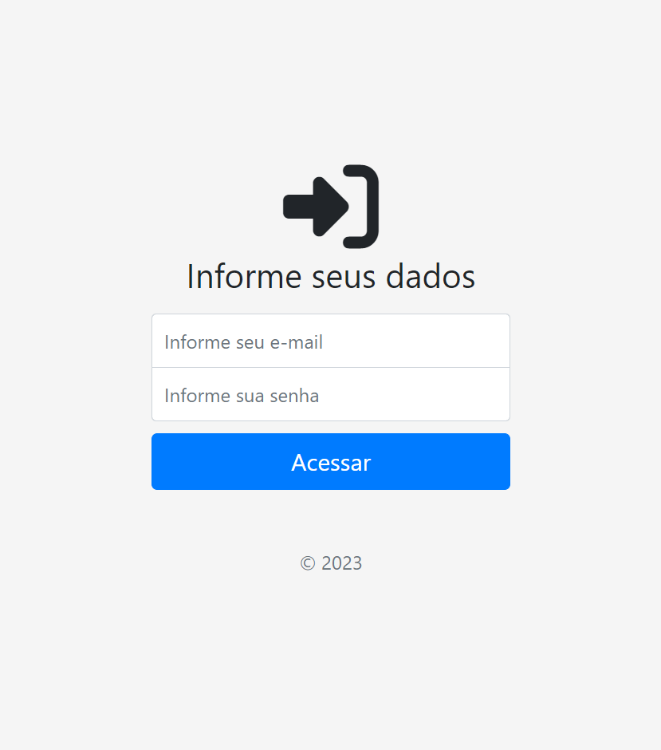
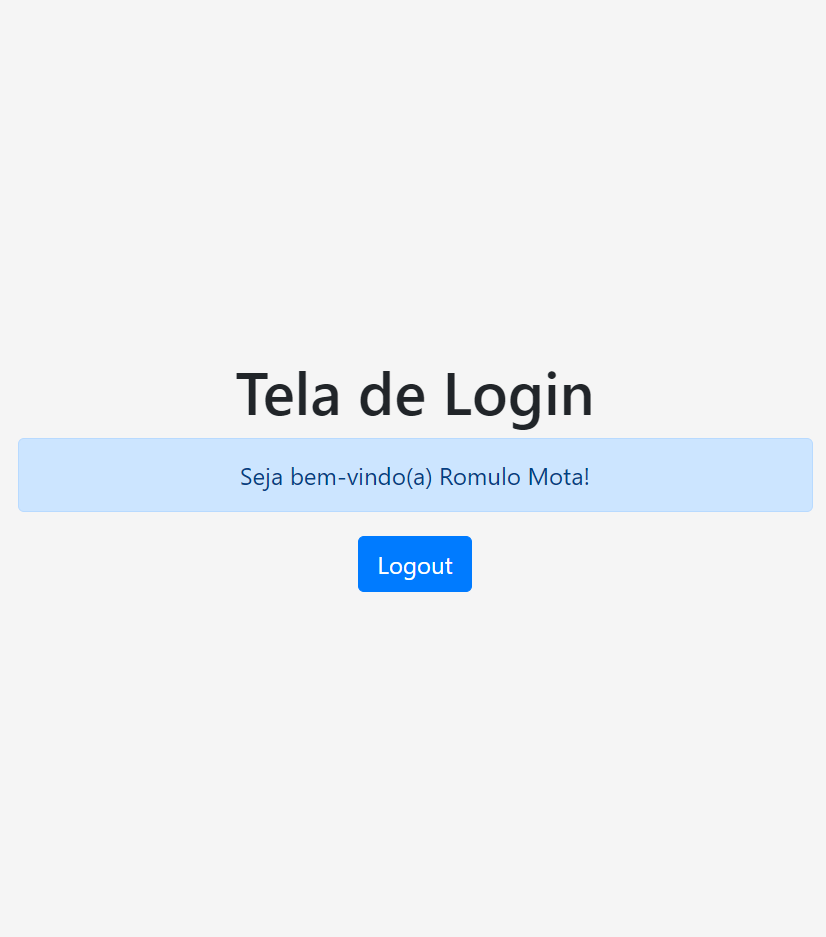

# Criação pagina de cadastro  
 

### Descrição:

O Django nos fornece todo um sistema próprio de autenticação e login,
porem em alguns projeto tende a necessidade de login e auteticação customizado,
como quando é necessario logar e autenticar o acesso por e-mail, cpf, telefone, etc.

Na aplicação e questão utilizei o e-mail, porem o preocesso é mesmo para os demais.

### O que foi feito:

- Criado projeto e aplicação
- Configurado settings 
- Criação do models
- Criação do forms 
- Criação do admin
- Criação das urls
- Criação dos templates

### Exemplo visual:

